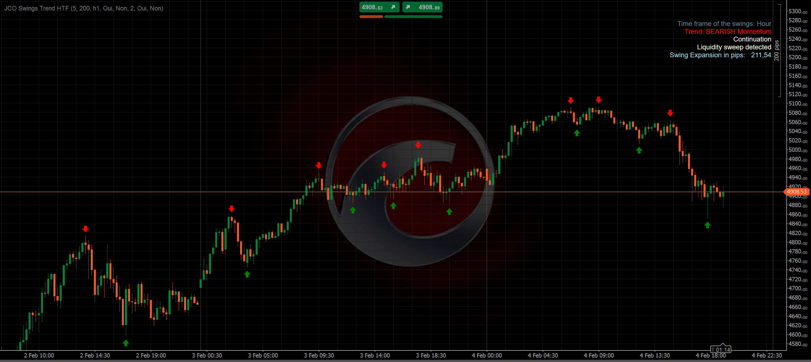

# JCO Swings Trend HTF Indicator



A cTrader indicator for detecting swing highs and lows on a higher timeframe (HTF) with advanced trend analysis, CHoCH detection, and liquidity sweep detection.

## Features

- **Trend Detection**: Identifies BULLISH (Higher Lows) / BEARISH (Lower Highs) / UNCLEAR market structure
- **Trend Status**: Momentum (perfect trend) vs Compression (slowdown/consolidation)
- **Gate Trend Change**: Trend reversal requires CHoCH confirmation to prevent premature flips
- **CHoCH Detection**: Change of Character - first sign of potential reversal (uses previous trend direction)
- **Dual CHoCH Liquidity Sweep**: When both CHoCH Bullish and Bearish are detected simultaneously, the most recent one wins and the opposing CHoCH is identified as a liquidity sweep
- **Liquidity Sweep Detection**: Identifies institutional stop hunting patterns
- **Swing Alternation**: Enforces High-Low-High-Low sequence
- **Confirmation Logic**: Waits for closed candles before confirming swings

## Installation

1. Copy the `JCO Swings Trend HTF.cs` file to your cTrader Indicators folder
2. Build the indicator in cTrader
3. Add to your chart

## Parameters

| Parameter | Default | Description |
|-----------|---------|-------------|
| Swing Period | 5 | Number of candles for fractal detection (left + right) |
| Swing Lookback Period | 200 | How many swings to analyze |
| Swing Time Frame | H1 | Higher timeframe for swing detection |
| Pip Value | 0.1 | Value of one pip for expansion calculation (e.g. 0.1 for gold) |
| Draw Icons | true | Show arrows at swing points |
| Draw Dots | true | Show dots at swing points |
| Icon Gap (%) | 2.0 | Gap between icon and candle (% of chart height) |
| Display Dashboard | true | Show trend info on chart |

## Dashboard Display

The indicator displays the following information:

```
Time frame of the swings: H1
Trend: BULLISH Momentum
Continuation
No liquidity sweep
Swing Expansion in pips: 45.2
```

## Trend Logic

### BULLISH Trend
Based on **Higher Lows** (LL1 > LL2 > LL3):
- **Momentum**: LL1 > LL2 AND HH1 > HH2 (perfect uptrend)
- **Compression**: LL1 > LL2 BUT HH1 < HH2 (highs are blocked)

### BEARISH Trend
Based on **Lower Highs** (HH1 < HH2 < HH3):
- **Momentum**: HH1 < HH2 AND LL1 < LL2 (perfect downtrend)
- **Compression**: HH1 < HH2 BUT LL1 > LL2 (lows are blocked)

## Gate Trend Change

Trend reversals require CHoCH confirmation to prevent premature flips. The gate compares the raw trend (swings 0,1,2) against the previous trend (swings 1,2,3):

| Previous Trend | Raw Trend | CHoCH | Result |
|----------------|-----------|-------|--------|
| BULLISH | BEARISH | CHoCH Bearish | BEARISH (confirmed reversal) |
| BULLISH | BEARISH | None | BULLISH Compression if HH1 > HH4, else UNCLEAR |
| BEARISH | BULLISH | CHoCH Bullish | BULLISH (confirmed reversal) |
| BEARISH | BULLISH | None | BEARISH Compression if LL1 < LL4, else UNCLEAR |
| Same | Same | - | Pass through raw direction |

## CHoCH (Change of Character)

CHoCH is an early warning signal of potential trend reversal. It uses the previous trend direction (calculated from swings 1,2,3) to detect transitions:

### CHoCH Bullish

- Previous trend was NOT bullish (or HH2 < HH3 if no previous trend available)
- Break: HH1 > HH2
- Candle must close above HH2

### CHoCH Bearish

- Previous trend was NOT bearish (or LL2 > LL3 if no previous trend available)
- Break: LL1 < LL2
- Candle must close below LL2

> **Note**: CHoCH is used by the Gate to confirm trend reversals. Without CHoCH, the gate maintains the previous trend as Compression or falls back to UNCLEAR.

### Dual CHoCH (Liquidity Sweep Pattern)

When both CHoCH Bullish and CHoCH Bearish are detected simultaneously (using structure-based analysis: HH2 < HH3 and LL2 > LL3), the indicator compares swing timestamps to determine priority:

| Previous Trend | Most Recent CHoCH | Result |
|----------------|-------------------|--------|
| BULLISH | CHoCH Bullish (SH0 > SL0) | Trend restored to BULLISH Momentum + Liquidity Sweep |
| BEARISH | CHoCH Bearish (SL0 > SH0) | Trend restored to BEARISH Momentum + Liquidity Sweep |
| BULLISH | CHoCH Bearish (SL0 > SH0) | Normal CHoCH Bearish (potential reversal) |
| BEARISH | CHoCH Bullish (SH0 > SL0) | Normal CHoCH Bullish (potential reversal) |

**Example**: In a BULLISH trend, price dips below the previous low (CHoCH Bearish), then reverses and makes a new high (CHoCH Bullish, more recent). The bearish dip is identified as a liquidity sweep, and the bullish trend is restored with Momentum status.

## Liquidity Sweep Detection

Detects institutional stop hunting patterns when price sweeps a swing level and reverses.

### Bullish Trend (analyze lows)

| Case | Condition | Description |
|------|-----------|-------------|
| 1 | LL2 < LL3 AND LL1 > LL2 AND HH1 > HH2 | LL2 swept below LL3 then price reversed |
| 2 | LL1 < LL2 AND (Close > LL2 OR HH1 > HH2) | New low made but rejected (wick or highs confirm) |

### Bearish Trend (analyze highs)

| Case | Condition | Description |
|------|-----------|-------------|
| 1 | HH2 > HH3 AND HH1 < HH2 AND LL1 < LL2 | HH2 swept above HH3 then price reversed |
| 2 | HH1 > HH2 AND (Close < HH2 OR LL1 < LL2) | New high made but rejected (wick or lows confirm) |

## Version History

- **v1.7** (2026-02-10): Dual CHoCH detection with liquidity sweep pattern; added Pip Value parameter for custom expansion calculation
- **v1.6** (2026-02-09): Gate Trend Change - reversals require CHoCH confirmation (aligned with TradingView v1.2)
- **v1.5** (2026-02-05): New liquidity sweep detection logic (aligned with TradingView version)
- **v1.4** (2026-02-04): Added Momentum/Compression status, simplified CHoCH, fixed swing confirmation
- **v1.3** (2026-02-02): Added CHoCH detection
- **v1.2** (2026-02-02): Added swing alternation, dynamic icon gap
- **v1.1**: Changed to 3-swing trend detection, 5-swing liquidity detection
- **v1.0**: Initial release

## License

MIT License - Feel free to use and modify.

## Author

Jerome Cornier
